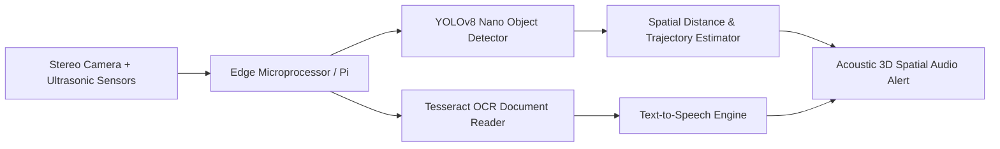

<div align="center">

# 👓 CHASHM-AI: Smart Assistive Vision Headset

<p align="center">
  <strong>AI-Powered Wearable Assistive Headset for the Visually Impaired (Final Year Project)</strong>
</p>

<p align="center">
      
</p>

<p align="center">
  <a href="#-overview">Overview</a> •
  <a href="#-system-architecture">Architecture</a> •
  <a href="#-key-features--capabilities">Key Features</a> •
  <a href="#-tech-stack--tools">Tech Stack</a> •
  <a href="#-quick-start">Quick Start</a> •
  <a href="#-author--license">Author</a>
</p>

</div>

---

## 📌 Overview

CHASHM-AI is an intelligent assistive vision wearable designed to empower visually impaired individuals with independent indoor and outdoor navigation, obstacle avoidance, depth estimation, and instant document text-to-speech reading.

---

## 🏗️ System Architecture



---

## ✨ Key Features & Capabilities

- 👁️ **Real-Time Edge Detection**: Custom quantized YOLOv8 model running at high FPS on embedded hardware.
- 🔊 **3D Spatial Audio Warnings**: Directional acoustic cues notifying distance and object categories.
- 📖 **Offline Document OCR**: Instant signboard and book text reading using on-device OCR.
- 🚶 **Smart Navigation Engine**: Real-time path clearance evaluation for safe obstacle avoidance.
- 🔋 **Low-Power Optimization**: Designed for long battery endurance on wearable power banks.

---

## 🛠️ Tech Stack & Tools

- **Python**
- **YOLOv8 Nano**
- **OpenCV**
- **PyTorch Mobile**
- **Tesseract OCR**
- **Raspberry Pi OS**

---

## 🚀 Quick Start

### 📋 Prerequisites
Ensure you have the required runtime environment installed:
* **Git** version 2.30+
* **Python 3.9+** / **Node.js 18+** / **Android Studio** (depending on project stack)

### 📥 Installation & Setup

```bash
# 1. Clone the repository
git clone https://github.com/muhammadokashapak/CHASHM-AI-Smart-Assistive-Headset-FYP-.git

# 2. Enter the directory
cd CHASHM-AI-Smart-Assistive-Headset-FYP-
```

---

## 👨‍💻 Author & License

<div align="center">

**Muhammad Okasha**
<br/>
*Deep Learning & Mobile Software Engineer*
<br/><br/>
<a href="https://github.com/muhammadokashapak"></a>
<a href="https://linkedin.com/in/muhammad-okasha"></a>
<a href="mailto:muhammadokashapak@gmail.com"></a>

<br/><br/>

*⭐️ If you find this project helpful, please consider giving it a star! • © 2026 [Muhammad Okasha](https://github.com/muhammadokashapak)*

</div>
